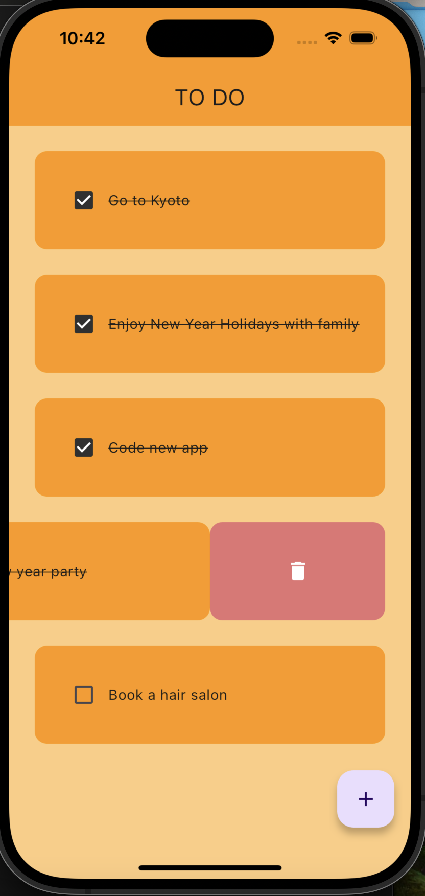
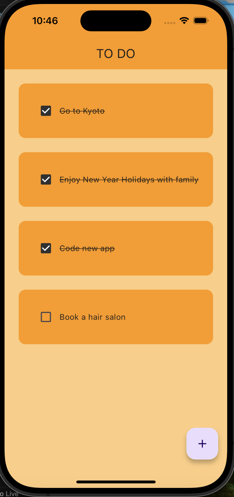

# 課題{8} -{DB 2回目 自主練 Flutterで作るTODO APP}-

## ①課題内容（どんな作品か）
- iOS機、Android機など、多数の端末で動作するアプリを共通のソースコードで作れる、とても魅力的なFlutterをこのタイミングで触りたかったので、Flutterの環境構築に15時間以上かかり、その後のTODO APPの制作に30時間ほどかかった自分の中では超大作です。
- 内容はシンプルなTODO APPで、TODOのタスクを+ボタン押下後のポップアップ画面で追加でき、完了したタスクにチェックを入れて横線引いて完了にでき、要らなくなったタスクを削除できる。
- localのdatabase Hiveを使用しているので、アプリを閉じた後に再起動しても、データは保持されるようにしました。

## ②工夫した点・こだわった点
- Flutterの環境構築がエラーだらけで、エラー解消のためにいろんな情報を調べながら試行錯誤しました。
- TODO APPの作成はチュートリアル動画を観て、初めて触れるWidgetという概念や、基本的な機能のコーディング方法を理解しながら、エラーと戦いながら進めました。
- 正月休みでせっかく時間があったので、とにかくアプリを作り切ることを意識しました。
- Stateless Widget, Stateful Widget, 継承, Controller, 変数, 配列, Container, databaseアクセスのためのHive設定yaml, databaseアクセスのコードの書き方など、基本的なflutterで必要な知識を満遍なく習うことができました。

## ③難しかった点・次回トライしたいこと（又は機能）
- Flutterの環境構築で設定やダウンロードする量が多く、Terminalコマンドを大量に打って、flutter doctorの8つのチェックが全部グリーンになるまで、試行錯誤しました。

- Terminalコマンドに少しでも慣れることができたのが、とてもいい収穫になりました。苦手意識が全くなくなりました。
- Android StudioからGitHubに直接コードをあげる方法が見つからなかったので、VS codeでFlutterを実行できるようにまた設定し直して、Terminalコマンドで
- TODO APPのチュートリアル動画が英語で、先生のコーディングがとても速かったので、0.75倍速で何回も撒き直しながらFlutterで機能を作るコードの構造を理解することができました。
- 途中エラーが24個出てきたときがあり、焦らず１個ずつ解消しました。ちょっとしたコーディングミスが大量のエラーにつながることを体得できました。
- 次回トライしたいことは、TODOのリストをカテゴリーごとに分けて管理できるようにしたいのと、FlutterとphpAdminをつなげる方法など、database周りをもっとスマートにしたいのと、ログイン機能の実装、セキュリティ対応周りをしっかりさせたいです。

## ④質問・疑問・感想、シェアしたいこと等なんでも
- [質問1] 全部独学なので、質問も基本的には自分で答えを調べて探していくイメージで考えています。

- [疑問] phpでWebアプリを作った際に、モバイルアプリで対応できるようにするにはどうしたらいいのか気になります。レスポンシブ対応だとモバイル版が使い勝手悪そうに感じられるため。

- [感想] 前々から触ってみたかったFlutterに触ることができてよかったです。構造としてもJavaの文法と似ていて、もっとスマートに表現できているので、引き続き機会があれば、Flutterでアプリを作っていきたいと思います。今回の課題おいては、初めてのFlutterということもあり、環境構築にすごく時間がかかり、基本的な機能の作成になりましたが、次回以降はより発展的なことができるように引き続きコーディング頑張ります。

- [tips] そろそろTerminalに少しずつ慣れていくことを始めたほうがいい時期なので、
 - https://qiita.com/ryouzi/items/f9dee1540a04a0bfb9a3

- [参考記事] 
 - https://www.youtube.com/watch?v=I6TpDuSFbTc
 - https://docs.flutter.dev/get-started/install/macos/mobile-ios
 - https://zenn.dev/heyhey1028/books/flutter-basics/viewer/getting_started_mac
 - https://coderenkin.com/unable-to-get-list-of-installed-simulator-runtimes/
 - https://note.com/favo_like/n/n64e46680d78d
 - https://qiita.com/oekazuma/items/92e9bae4268fea107efa
 - https://qiita.com/ryamate/items/e51c77fbabc2aec185fc
 - https://stackoverflow.com/questions/76968264/how-can-i-solve-using-the-impeller-rendering-backend-error
 - https://github.com/flutter/flutter/issues/137842
 - https://github.com/flutter/flutter/issues/136046#issuecomment-1753460065
 - https://qiita.com/kappaLab/items/602fcdaaa076efa59c3b
 - https://www.youtube.com/watch?v=HQ_ytw58tC4
 - https://zenn.dev/flutteruniv/books/flutter-textbook/viewer/hello-world#%E5%8B%95%E7%94%BB%E6%95%99%E6%9D%90%E3%81%AF%E3%81%93%E3%81%A1%E3%82%89
 - https://zenn.dev/rabee/articles/vscode-multiple-cursors-shortcut
 - https://zenn.dev/adjaper/articles/7bc1934c938518

## Getting Started

This project is a starting point for a Flutter application.

A few resources to get you started if this is your first Flutter project:

- [Lab: Write your first Flutter app](https://docs.flutter.dev/get-started/codelab)
- [Cookbook: Useful Flutter samples](https://docs.flutter.dev/cookbook)

For help getting started with Flutter development, view the
[online documentation](https://docs.flutter.dev/), which offers tutorials,
samples, guidance on mobile development, and a full API reference.
